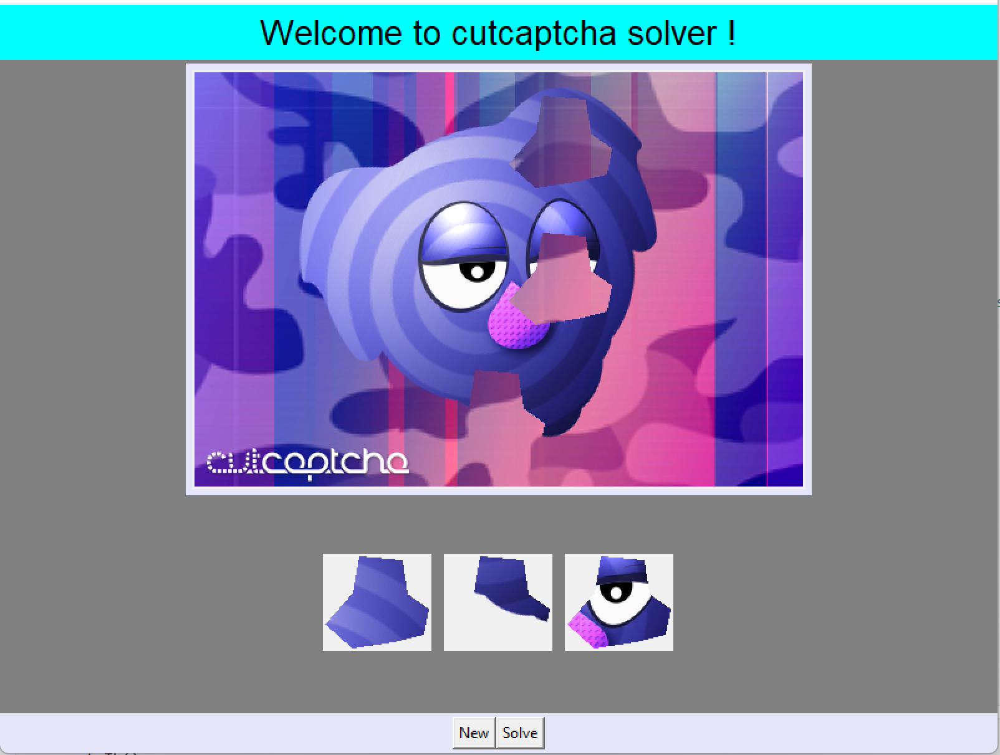
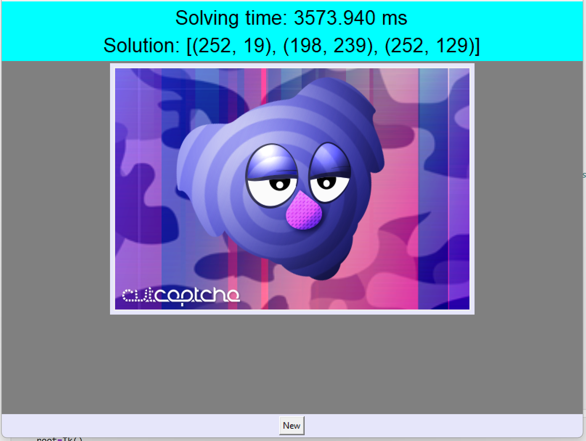

<p align="center">
  
  
</p>

# CUTCAPTCHASOLVER

Msc Project (UWE Bristol) providing a CAPTCHA solver for cutcaptcha. If you want to know what is a cutcaptcha, follow the link: https://filecrypt.cc/Contact.html


## Name
**CUTCAPTCHASOLVER** is an application that provides solution to cutcaptcha challenges.

## Description
CutCAPTCHA displays an incomplete image with three puzzle pieces and asks users to assemble the image. Users must drag and drop the three puzzle pieces into the correct position to pass the CAPTCHA test. For a demo follow the link: https://filecrypt.cc/Contact.html. This project provides an application to solve cutcaptcha challenges by giving a solution to the challenge as (x,y) coordinates.

## Installation
The project has been developed using Jupyter Notebook, so to run the application:

* Clone the repository, enter the project's folder and launch the notebook:
```
cd cutcaptcha
jupyter-notebook GUI.ipynb
```

* Then on your browser go to:
```
http://localhost:8888/notebooks/GUI.ipynb
```
Non-exhaustive list of dependencies to install on Debian-based machines:
```
	jupyter-notebook
	python-numpy
	python3-opencv
	python3-tk
```
Once on the notebook, click on the "Cell" menu, then "Run all"

## Usage

The application is quite user friendly, there are two buttons: **New** and **Solve**:

- **New** allows you to download the images of a cutcaptcha challenge from the Internet and displays them on the application
- **Solve** launches the solver for the challenge downloaded and print out on the application the solution of the challenge as (x,y) coordinates denoting the respective correct positions of the puzzle pieces.

<!-- ## Support

For any enquiry related to the project please contact:
	micdejc@gmail.com
	hamza.attak@gmail.com -->

## Roadmap
To improve the application we are looking forward to explore:

- **The measurement of the image colour continuity** in combination with the proposed approach to improve the accuracy of the suggested solver
- **The calculation of the right values of Sigma and Threshold** while using the canny egde detection algorithm since in this project, static values have been used and affect in some point the accuracy of the proposed solver.


<!-- ## Authors and acknowledgment
Thanks to :
- Hamza Attak
- Ian Johnson
- Phil Legg -->

## License
All right reserved.
