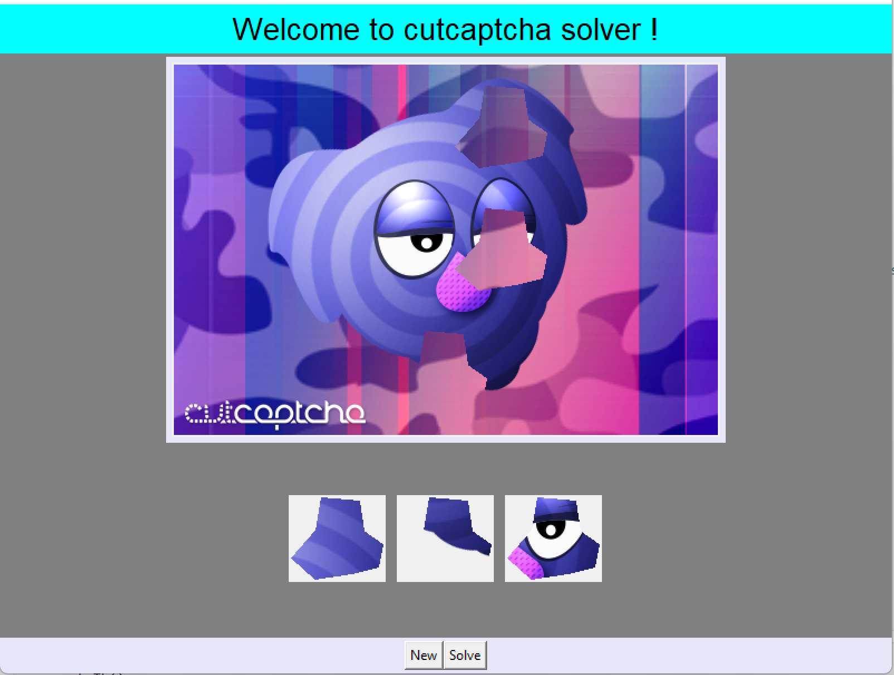
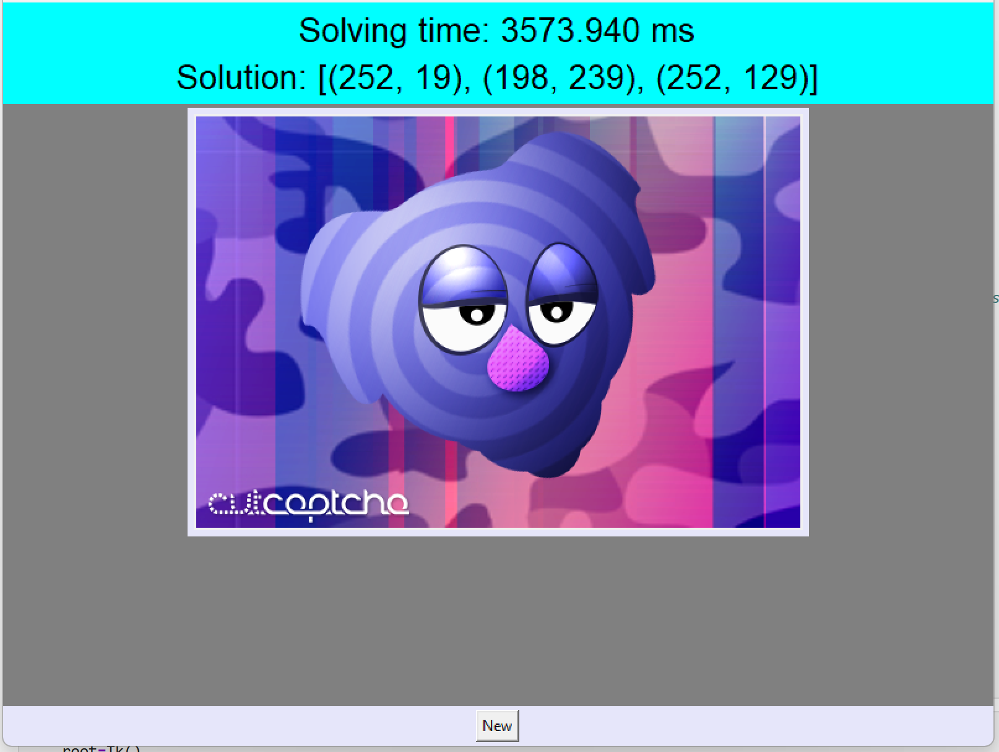

<p align="center">
  
  
</p>

# Automatic Bypassing of cutCAPTCHA Using Canny Edge detection and Template Matching

## Overview
This repository contains a research prototype developed at the University of the West of England (UWE), UK, in 2022. It implements a lightweight automated solver for CutCAPTCHA challenges without using machine learning or artificial intelligence.

For background information and a public demonstration of cutCAPTCHA, refer to:  
https://filecrypt.cc/Contact.html

---
## Updates
- (2026-08-05) The paper was presented at the 6th IEEE International Conference On Cyber Security and Resilience, Lisbon, Portugal. LinkedIn Post: [Here](https://www.linkedin.com/posts/michael-tchuindjang-38829317b_cybersecurity-ai-research-ugcPost-7490925236801048576-ZsoO)
- (2026-04-08) Paper was accepted at the 2026 IEEE International Conference on Cyber Security and Resilience (IEEE CSR), to be held at Lisbon, Portugal from August 3–5, 2026.
---

## Description
cutCAPTCHA is a puzzle-based CAPTCHA that presents a partially reconstructed image and requires users to correctly reposition three missing fragments using drag-and-drop interactions.

This project implements an automated attack pipeline that estimates the correct placement of the three puzzle fragments and outputs their corresponding \((x, y)\) coordinates within the challenge image.

---

## Installation

The project is implemented in **Python using Jupyter Notebook**. To run the system:

### 1. Clone the repository
```bash
cd cutcaptcha
jupyter-notebook cutcaptchasolver.ipynb
```

### 2. Open in browser
```
http://localhost:8888/notebooks/cutcaptchasolver.ipynb
```
### 3. Dependencies
Install the required packages:
```
	jupyter-notebook
	python-numpy
	python3-opencv
	python3-tk
```
Once on the notebook, click on the "Cell" menu, then "Run"

## Reproducibility

A note for hardware: all experiments we run  on a standard desktop machine equipped with an Intel Core i5-6500 CPU@3.20 GHz with 16 GB of RAM. 

## Usage

The application provides a simple graphical interface with two main actions:

- **New:** Downloads a new cutCAPTCHA challenge and displays the challenge image along with the puzzle fragments.
- **Solve:** Executes the solver pipeline and outputs the estimated solution as \((x, y)\) coordinates corresponding to the correct placement of each puzzle fragment.


## Roadmap / Future Improvements
Future work aims to improve the robustness and generalization of the solver by exploring the following directions:

- Incorporation of **color continuity features** to improve matching accuracy in visually similar fragments.
- **Adaptive parameter selection** for Canny edge detection to replace fixed threshold values and improve accuracy across diverse images.

## Contributions
Special thanks to the following co-authors:
- Hamza Attak
- Ian Johnson
- [Phil Legg](https://github.com/pa-legg)


## Disclaimer
This project is intended for **research and security analysis purposes only**, focusing on evaluating the resilience of puzzle-based CAPTCHA systems under controlled experimental conditions.

## License
All right reserved.
